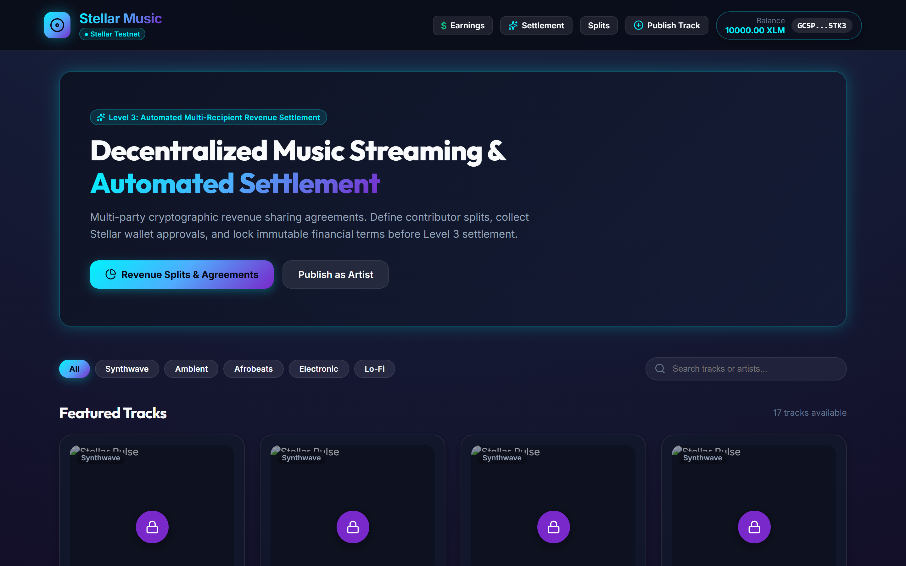
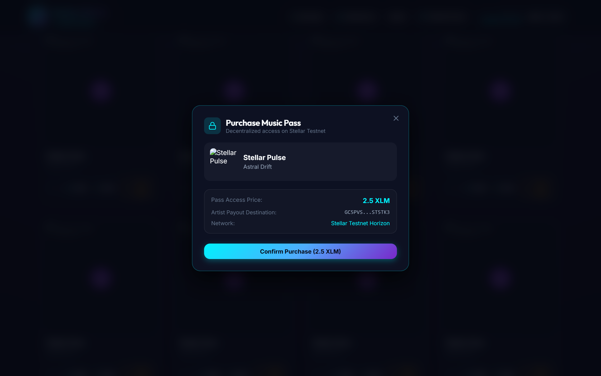
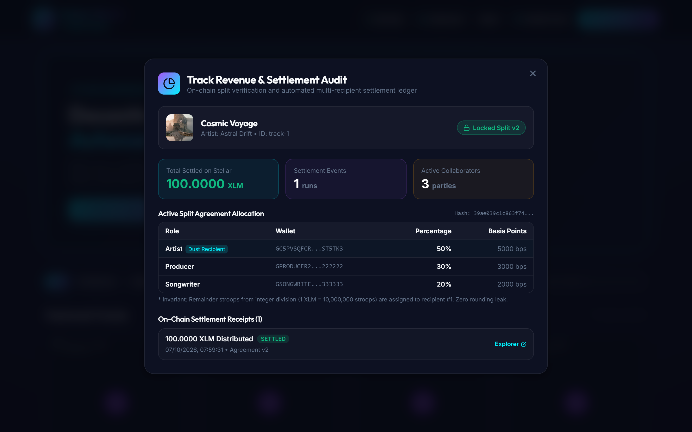

# 🎵 Stellar Music — Frontend (`stellar-music-frontend`)

[](https://stellar-music-app.netlify.app)
[](https://stellar-music-app.netlify.app)
[](https://stellar.expert/explorer/testnet)
[](https://react.dev/)
[](https://vitejs.dev/)

The decentralized music streaming web application, royalty management studio, and automated revenue settlement portal for **Stellar Music**.

> **🚀 Production URL**: [https://stellar-music-app.netlify.app](https://stellar-music-app.netlify.app)

---

## 📌 Application Architecture & Core Principles

Stellar Music provides an intuitive, high-fidelity music streaming product backed by non-custodial Stellar payments:

* **Real Stellar Testnet Integration**: Direct integration with Stellar Testnet keypairs, Horizon balances, Friendbot funding, and cryptographic transaction submission.
* **Non-Custodial Pass Payments**: Listeners purchase access passes with XLM transferred directly to artist accounts or escrow contracts with cryptographic replay prevention.
* **Collaborator Revenue Splits**: Artists and collaborators configure, review, and sign revenue-sharing agreements. Strict 10,000 basis points (100.00%) allocation is validated across the client, API, and smart contracts.
* **Automated Multi-Recipient Settlements**: Streaming revenue pools trigger automated distributions to all verified collaborator wallets on Stellar with zero rounding loss.
* **Live Financial Observability**: Contributor earnings dashboards, artist catalog revenue metrics, track settlement receipts, and real-time Server-Sent Events (SSE) toast broadcasts.

```
                  ┌─────────────────────────────────────┐
                  │      Stellar Music Web Client       │
                  │   (https://stellar-music-app.netlify.app)
                  └──────────────────┬──────────────────┘
                                     │
         ┌───────────────────────────┼───────────────────────────┐
         │                           │                           │
         ▼                           ▼                           ▼
┌──────────────────┐       ┌──────────────────┐       ┌─────────────────────┐
│  Music Streaming │       │ Split Agreement  │       │ Settlement & Payout │
│      Engine      │       │      Studio      │       │      Dashboard      │
├──────────────────┤       ├──────────────────┤       ├─────────────────────┤
│ - Range Audio    │       │ - Multi-Party    │       │ - Contributor Cuts  │
│ - Music Passes   │       │ - 100.0% Rules   │       │ - Auto Batch Settle │
│ - Friendbot XLM  │       │ - SHA-256 Hashes │       │ - Explorer Receipts │
│ - Persistent Bar │       │ - Agreement Lock │       │ - SSE Live Alerts   │
└──────────────────┘       └──────────────────┘       └─────────────────────┘
```

---

## 📸 Product Functionality Walkthrough

### 1. Music Discovery & Range Audio Streaming
High-fidelity streaming catalog featuring audio preview, real-time genre filtering, instant keypair wallet connection, and a persistent playback bar with seekbar and volume controls.


---

### 2. Level 1 — Non-Custodial Music Pass Access
Listeners purchase track access passes with instant Stellar Testnet XLM transactions. Unlocks authenticated HTTP 206 Partial Content range audio playback with cryptographic replay protection.


---

### 3. Level 2 — Collaborator Revenue Split Studio & Multi-Party Signing
Artists define multi-party split agreements with exact 10,000 basis points (100.00%) allocation. All contributors cryptographically sign terms bound by SHA-256 agreement hashes, locking the agreement permanently.


---

### 4. Level 3 — Contributor Royalty & Earnings Dashboard
Contributors track real-time lifetime earnings, pending pool royalties, and settled XLM across all collaborative tracks with direct links to on-chain Stellar transactions.


---

### 5. Level 3 — Artist Automated Settlement Engine
Catalog-level financial observatory displaying gross streaming revenue, pending balances, and 1-click batch multi-recipient settlement execution across all eligible tracks.


---

### 6. Level 3 — Track Revenue & On-Chain Settlement Auditor
Inspect per-track streaming revenue pools, verify immutable split terms, view the zero-leak stroop dust remainder allocation, and audit historical multi-recipient disbursement receipts.


---

## 🌟 Key Features & User Experience

### 1. Music Discovery & Range Audio Streaming
* High-definition audio playback powered by HTML5 Audio and authenticated HTTP 206 Partial Content range delivery.
* Persistent audio playback bar with scrubbable seekbar, volume control, track queuing, and keyboard shortcuts (`Space` for Play/Pause).
* Genre filtering (Synthwave, Ambient, Afrobeats, Electronic, Lo-Fi) and instantaneous catalog search.

### 2. Stellar Testnet Wallet Experience
* 1-click testnet wallet generation and connection.
* Direct integration with SDF Friendbot for instant 10,000 Testnet XLM funding.
* Live balance polling and transaction links to Stellar Expert Explorer.

### 3. Collaborator Revenue Split Studio
* Artists define contributor roles (Producer, Vocalist, Mixing, Songwriter, Master) and percentage shares.
* Real-time client-side and server-side validation ensuring allocations equal exactly 100.0% (10,000 basis points).
* Multi-party agreement signing with SHA-256 agreement term hashing.
* Automatic agreement locking when all required collaborators sign.

### 4. Contributor Royalty & Earnings Portal
* Dedicated contributor dashboard displaying lifetime earned XLM, settled XLM, and pending revenue.
* Per-track revenue share breakdown with basis points precision.
* Complete on-chain settlement receipts with clickable Stellar Expert transaction links.

### 5. Artist Settlement Engine
* Catalog-wide gross streaming revenue tracking and pending pool balances.
* 1-click "Run Automated Settlement" for batch processing across all eligible tracks.
* Track-level "Settle Now" triggers for immediate on-chain disbursement.
* Real-time settlement notifications via Server-Sent Events (SSE).

### 6. Public Track Revenue & Settlement Auditor
* Accessible from any track card to inspect gross pool intake, active locked split agreement hash, remainder dust allocation rules (Index 0 primary artist invariant), and verifiable payout ledger.

---

## 🛑 Client Error Handling, Toast Alerts & UX Resilience

The frontend application features robust client-side validation, user feedback alerts, and error boundary containment:

| Feature / Action | Error Condition | UI Message & Recovery Behavior |
| :--- | :--- | :--- |
| **Split Agreement Allocation** | Shares do not total 100.0% | Real-time red badge indicator: `"Total allocation must equal 100% (currently X%)"`. Save button remains disabled. |
| **Collaborator Configuration** | Duplicate recipient address | Warning alert: `"Recipient wallet address is already added"`. Duplicates cannot be submitted. |
| **Pass Purchase** | Insufficient balance or tx error | Error toast: `"Payment failed: [Error details]"`. User prompted to request Friendbot funding. |
| **Audio Playback** | No valid access pass | Redirects to purchase modal: `"A confirmed Music Pass is required to stream this track"`. |
| **Collaborator Signing** | Signer address mismatch | Error alert: `"Current wallet is not listed as an active contributor for this agreement"`. |
| **Settlement Execution** | Agreement not yet locked | Guard modal: `"Settlement blocked: Agreement must be signed by all parties and LOCKED first"`. |
| **Settlement Execution** | Zero pending revenue | Info banner: `"No pending revenue available in this track pool for distribution"`. |
| **Realtime Updates** | SSE connection interruption | Automatic background reconnection with exponential backoff; no page refresh required. |

---

## 🛠️ Technology Stack

* **Framework**: React 18 with TypeScript
* **Build Tool**: Vite 5
* **Styling**: Modern Vanilla CSS Design System with dark glassmorphism, tailored HSL color tokens, and smooth micro-animations
* **Icons**: Lucide React
* **Blockchain SDK**: `@stellar/stellar-sdk` & Soroban RPC client
* **Deployment**: Netlify Edge CDN with automated CI/CD

---

## 🚀 Running Locally

```bash
# Clone the repository
git clone https://github.com/Stellar-Music/stellar-music-frontend.git
cd stellar-music-frontend

# Install dependencies
npm install

# Start Vite development server
npm run dev

# Build production bundle
npm run build
```

---

## 🌐 Production Links

* **Live Web Application**: [https://stellar-music-app.netlify.app](https://stellar-music-app.netlify.app)
* **Stellar Network**: Testnet
* **Explorer**: [Stellar Expert Testnet Explorer](https://stellar.expert/explorer/testnet)
* **Smart Contracts Repository**: [Stellar-Music/stellar-music-contracts](https://github.com/Stellar-Music/stellar-music-contracts)
* **Backend Repository**: [Stellar-Music/stellar-music-backend](https://github.com/Stellar-Music/stellar-music-backend)
